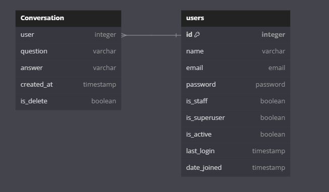
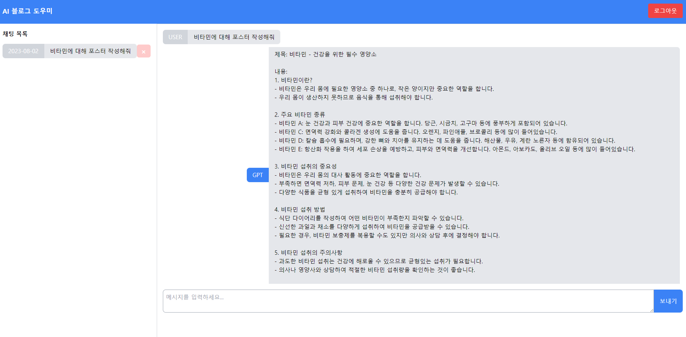
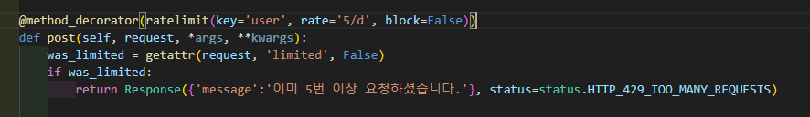

# ChatGPT-Django
ChatGPT를 사용한 Django 프로젝트  
AI 기반 블로그 포스트 작성 도우미

# 배포
- 프론트엔드 github  
https://github.com/beerbank3/ChatGPT-Django-FE  
- 사이트 URL  
http://gptdjango.site/
# ERD 모델



# 폴더 구조 
```
|   .env
|   .gitignore
|   data_seed.txt
|   db.sqlite3
|   manage.py
|   README.md
|   requirements.txt
|
+---.config
|   \---uwsgi
|           uwsgi.ini
|           uwsgi.service
|
+---app
|   |   asgi.py
|   |   settings.env
|   |   settings.py
|   |   urls.py
|   |   wsgi.py
|   |   __init__.py
|
+---chatbot
|   |   admin.py
|   |   apps.py
|   |   decorators.py
|   |   models.py
|   |   tests.py
|   |   urls.py
|   |   views.py
|   |   __init__.py
|
+---README
|       base.png
|       day5.png
|       daycode.png
|       ERD.png
|       login.png
|       main.png
|       register.png
|
\---user
    |   admin.py
    |   apps.py
    |   forms.py
    |   models.py
    |   serializers.py
    |   tests.py
    |   urls.py
    |   views.py
    |   __init__.py

```
# 요구사항

**모든 구현은 DRF를 이용하여서 구현**

1. 기본 프로젝트 설정 및 모델 설계:
- Django 프로젝트 생성 및 기본 설정
- User 모델 설계
- Chat 모델 설계

2. 회원가입과 로그인 구현:
- 회원가입 기능 구현
- 로그인 기능 구현

3. ChatGPT API 구현:
- ChatGPT로 요청을 보내주는 API 구현

4. 채팅 저장 기능 구현:
- 채팅 저장용 API 구현 APIView
- 사용자별 하루 5번 요청 제한 로직 추가

5. 채팅 조회 기능 구현:
- 저장된 채팅 내역 조회용 API 구현

6. 프론트엔드 연동:
- 프론트엔드에서 Django 서버를 통해 챗봇 API 요청 보내는 로직 구현
- API 응답값을 프론트엔드에 반영하는 로직 추가

7. 배포:
- 내 github-page를 http로 배포하기


# 페이지
- 메인페이지


- 회원가입, 로그인  


- 글쓰기 기능


- 하루5번 요청 가능  



# 개발하면서 만난 에러들

- 에러메세지
```
django.db.migrations.exceptions.InconsistentMigrationHistory: Migration admin.0001_initial is applied before its dependency user.0001_initial on database 'default'.
```

- app.settings.py
```
INSTALLED_APPS = [
    'django.contrib.admin', # 주석처리
]
```

- app.urls.py
```
from django.contrib import admin #주석처리

urlpatterns = [
    path('admin/', admin.site.urls), #주석처리
]
```